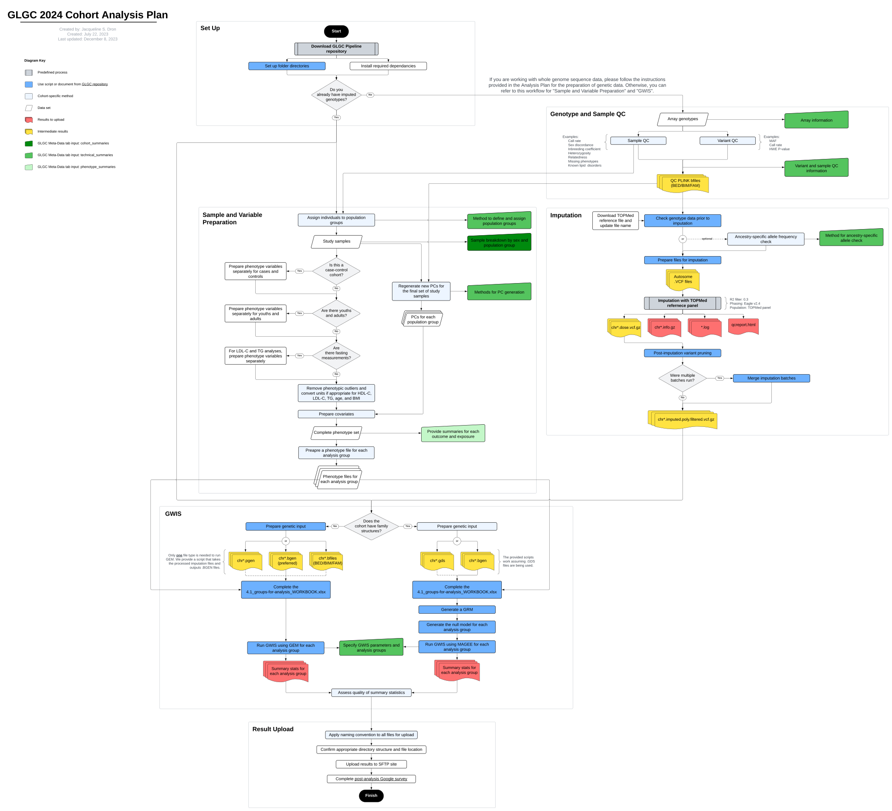

# GLGC 2024 Cohort Analysis Pipeline

This repo contains all the necessary scripts for study cohorts to run through the GLGC 2024 Cohort Analysis Pipeline. If you are interested in joining the [Global Lipids Genetics Consortium](http://www.lipidgenetics.org/), please contact Gina Peloso <gpeloso@bu.edu>.

Current version: 1.0

## Table of Contents

- [Installation](#installation)
- [Dependancies](#dependancies)
- [Analysis Plan](#analysisplan)
- [Contact](#contact)

## Installation

To download the relevant scripts and files for GLGC 2024 Cohort Analysis Pipeline, run the following code: 
```bash
git clone https://github.com/Global-Lipids-Genetics/glgc_gwis.git
```

## Dependancies
An image has been assembled with all the required software and dependencies for this analysis plan: [docker://skoyamamd/glgc](https://hub.docker.com/r/skoyamamd/glgc)

Alternatively, you can install each individual software. Note that studies will only need either GEM or MAGEE, depending on if there are unrelated or related individuals, respectively. 
- [BGZIP and tabix](http://www.htslib.org/download/) (0.2.6 or above), which can be downloaded as part of the `htslib` package
- [BCFtools](http://www.htslib.org/download/) (1.3.1 or above)
- [QCTOOL](https://www.well.ox.ac.uk/~gav/qctool_v2/documentation/download.html) (2.0.1 or above) 
- [vcftools](https://github.com/vcftools/vcftools) (0.1.8 or above)
- [PLINK 1.9](https://www.cog-genomics.org/plink/) 
- [PLINK 2.0](https://www.cog-genomics.org/plink/2.0/)
- [GEM](https://github.com/large-scale-gxe-methods/GEM) (1.4.5 or above)
- [MAGEE](https://github.com/large-scale-gxe-methods/MAGEE) (1.3.0 or above) 
- R (4.1.0 or above)

## Overview
A flowchart overview of the [analysis plan](#analysisplan) is provided: `./helper/2024_GLGC_Analysis_Plan.pdf`


## Analysis Plan
The analysis plan can be found here: [GLGC 2024 - Cohort Analysis Plan](https://docs.google.com/document/d/1x8F1o4krajNPLwoeJwzirMLveVs1HGlF1Z2eSnBGjo0/edit?usp=sharing) 

## Contact
If you have any questions or feedback, please open an issue in this repository or contact the appropriate person listed in the analysis plan document. 
